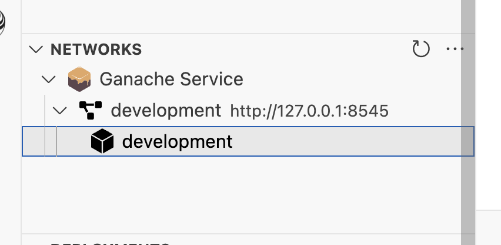
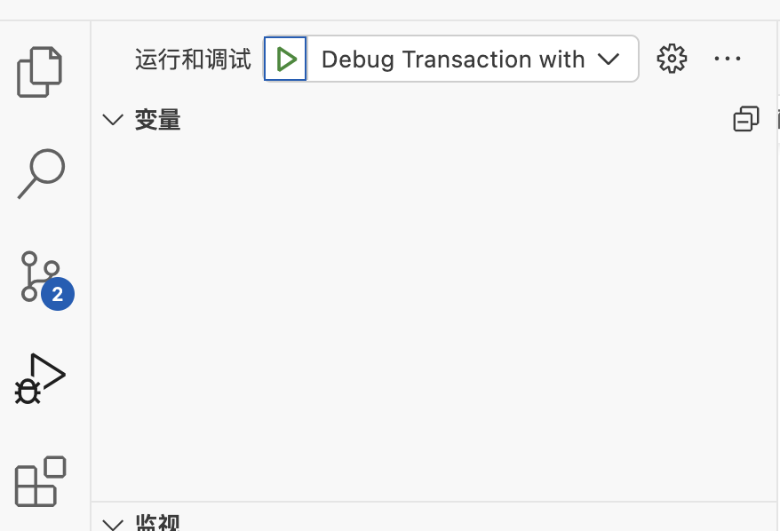

# 仿ebay 分布式 区块链  竞拍项目 
> 对应的视频教程，其中版本坑比较多：https://www.bilibili.com/video/BV1EJ411D7SL?p=1
> 本项目主要是学习以太坊区块链

## 功能说明

1. 商品列表
2. 商品新增
3. 商品详情
4. 商品竞拍+隐藏、竞价揭示、平台结束、打款委托合约仲裁投票
5. 最后与中心化业务后端服务结合：这块我是后端所以看了下原理就没敲了（监听emit 事件，然后保存到数据库，列表再查询出来）
6. 补充了一些样式上的显示和跳转

## 环境准备

###  ipfs

1. 配置环境变量、或者直接写死

> export ipfs_staging=/root/ipfs/staging/
> export ipfs_data=/root/ipfs/data/

2. docker 启动
> docker run -d --name ipfs -v $ipfs_staging:/export -v $ipfs_data:/data/ipfs -p 4001:4001 -p 4001:4001/udp -p 5001:5001 -p 8080:8080  ipfs/kubo:latest
3. 进入docker 容器
> docker exec -it ipfs /bin/sh
4. 然后添加cros  
> ipfs config --json API.HTTPHeaders.Access-Control-Allow-Origin '["*"]' 
5. 然后重启docker 容器 
> docker restart ipfs
6. 访问5001 
> http://ip:5001/webui 

### 安装vs插件 Truffle for VS Code 

1. 搜索后直接安装
2. 安装完成后可以直接在这边创建ganache 

3. 需要debug 可以在异常的情况下复制交易hash，然后在.vscode/launch.json 粘贴后执行

## 运行
1. 先安装依赖：npm install
2. 启动ganache 使用插件
3. 编译：truffle compile
4. 部署：truffle migrate --reset
5. 启动前端项目：npm run dev

## 问题与说明

### 我的全部运行版本

ide ： vs code 

安装插件：Truffle for VS Code v2.7.1

node：v16.14.2.

Truffle v5.11.5 (core: 5.11.5)
> 后面会不维护了，https://trufflesuite.com/docs/truffle/how-to/migrate-to-hardhat/

Ganache v7.9.1

Solidity - ^0.6.8 (solc-js)

Node v16.14.2

Web3.js v1.10.0

###  solidity 版本不一致出现的问题

高版本要求更高，会编译不通过，可以参考我的写法，我是用的0.6.8版本，低版本可以自行修改。

### 还有其他的欢迎issue交流，有帮助请star
   
